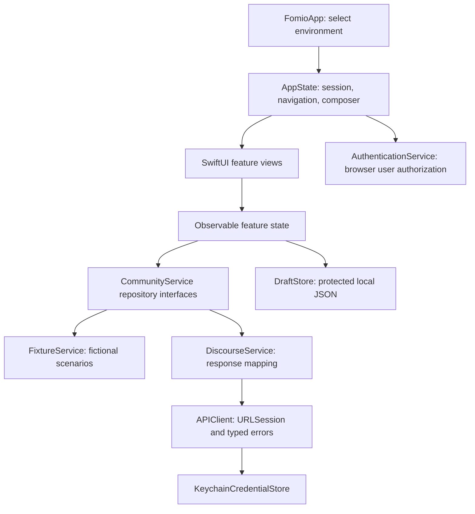

# Native app architecture

Implementation baseline: 2026-10-03. This describes the code currently present, not a deployed integration guarantee. Read [status](implementation-status.md) and [API evidence](discourse-api-reference.md) alongside it.

## Ownership and dependency flow

Swift 6 strict concurrency is enabled. Mutable app, repository and feature state is isolated to the main actor; network calls suspend through Swift concurrency. SwiftUI Observation owns UI updates. `FomioApp` creates one service and injects it through `AppState`; views access the app through the environment. This is a small explicit composition root, without a service locator or third-party dependency framework.

| Area | Source | Responsibility |
| --- | --- | --- |
| Composition/navigation | `Fomio/App/FomioApp.swift`, `AppState.swift` | Development/live selection, four tab stacks, sheets, auth intent, account and routing |
| Domain | `Fomio/Domain/Models.swift` | Typed identities, display models, thread pages, draft/upload/write outcomes |
| Interfaces | `Fomio/Domain/Repositories.swift` | Feed, community, discussion, search, notification, profile, bookmark, posting and upload contracts |
| Fixtures | `Fomio/Data/FixtureService.swift` | In-memory fictional content and deterministic failure/outcome controls |
| Live adapter | `Fomio/Data/DiscourseService.swift` | Source-informed endpoint calls, optional DTO decoding, domain mapping |
| Transport | `Fomio/Data/Network.swift` | Relative-root URLs, per-user headers, cancellation, status/error semantics, upload progress and logical links |
| Authentication | `Fomio/Data/Authentication.swift` | Browser authorization, callback validation, RSA decryption and Keychain credentials |
| Persistence | `Fomio/Data/DraftStore.swift` | Atomic protected JSON, account filtering, deletion and guest migration |
| Features | `Fomio/Features/` | Feed/directory, normalized discussion state, composer, account/supporting screens and cooked content |
| Visual system | `Fomio/Design/Theme.swift`, `Resources/` | Semantic styling, adaptive palette, reading column, wordmark and photo credits |
| Validation | `FomioTests/`, `FomioUITests/` | Domain/persistence/adapter tests and native journeys |

## Domain identity

`EntityID<Tag>` prevents confusing `TopicID`, `PostID`, `PostNumber` and `CategoryID`, even though their wire representation is numeric. Navigation uses topic ID and optional post number. Like/bookmark mutations use post ID; bookmark deletion uses the returned bookmark identity. A category with a parent is a subcommunity, not a separate model type.

`AccountID` is a local scope: guest, fixture, or live site URL plus username. It is not a backend user ID. The exact configured base URL participates in credential and account storage; normalize and retain it consistently before live rollout. Changing site URL or username may strand an older local account scope. No account migration tool exists yet.

## Navigation and retained state

`AppTab` defines Home, Communities, Notifications and Me. Each `TabState` holds its own `Route` path, feed cache, discussion cache, community query/expansions and search query/results/pagination/anchor. Search is pushed into the originating stack. Create/Reply/Quote/Resume present one composer with an explicit origin. Publication returns to that tab and opens the resulting exact post, clearing its stale feed/discussion caches.

`FeedState` retains rows, pagination and reading anchor. `DiscussionState` normalizes posts by post ID, tracks roots/child lists, independent pagination, expanded branches, per-branch errors and highlighted target. Child branches begin collapsed. Three visible levels lead to a focused thread route. Exact-post context keeps at most two visible ancestors plus the target and reports truncated context.

The system tab view is `sidebarAdaptable`; regular-width iPad offers native sidebar behavior. Content uses a 620-point maximum reading column. Composer uses a large native sheet and form presentation sizing. Native bars and controls supply Liquid Glass; content remains flat.

State retention is in memory for navigation, reading, branch expansion and search. Only drafts and credentials survive process termination. Supporting lists such as notifications/profile/Saved use view-local state and can reload after reconstruction. Do not describe every screen’s position as durably persisted.

## Transport and rendering

`APIClient` uses an ephemeral URLSession with a 30-second request timeout, injected credentials for tests, same-origin redirect checks, and optional upload progress. It attaches `User-Api-Key` and `User-Api-Client-Id` when available. It distinguishes authorization, denial, unavailable resources, validation, rate limiting, transport failure and uncertain writes. No automatic posting retry is configured.

Discourse DTOs decode optional permission/content fields and map into native domain models. Categories flatten recursive `subcategory_list`; deleted nested placeholders inherit topic identity when omitted. Root metadata is cached for later nested pages. Search uses post result order and exact post numbers rather than assuming a topic list expresses result order.

`CookedContent` renders supported text, links, quotes, code and public HTTPS images natively. Unsupported structures get an explicit original-post link. It is a lightweight markup parser, not a full HTML engine. Secure media and deployment-specific markup require further work. No embedded JavaScript executes.

## Security and persistence boundaries

Credentials live in Keychain using device-only protection. Drafts use app-container file protection until first user authentication and atomic JSON writes. Account isolation is enforced by filtering records, not separate encrypted account directories. File protection is not an additional application-level encryption scheme. Sign-out clears current-account drafts and credentials; it does not erase other accounts’ drafts or delete server posts.

Draft records are version 2 with version-1 decoding and quote/photo migration. Unknown versions are rejected; there is no corruption quarantine system. A malformed JSON file can fail a list operation. Photo bytes live in protected account-scoped files with atomic draft metadata and orphan reconciliation. Raw Discourse markup is persistence/submission authority; TextKit rich text is an editable projection. See [recovery behavior](flows-and-recovery.md).

## Extension rules

Add domain/interface behavior before adding endpoint assumptions to a view. Keep fixtures and live adapters behind the same repository contract. Record source evidence and live status when changing an adapter. Preserve independent draft/upload/auth/submission states and exact identities. Add meaningful tests for new contracts or recovery risks; never use fixture success as proof of deployed behavior.
