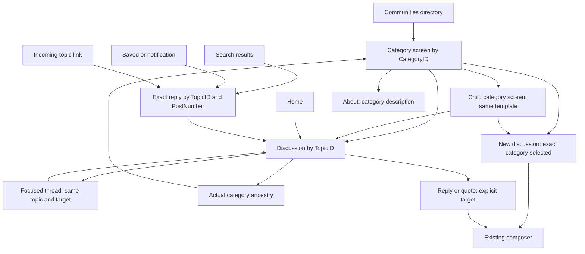
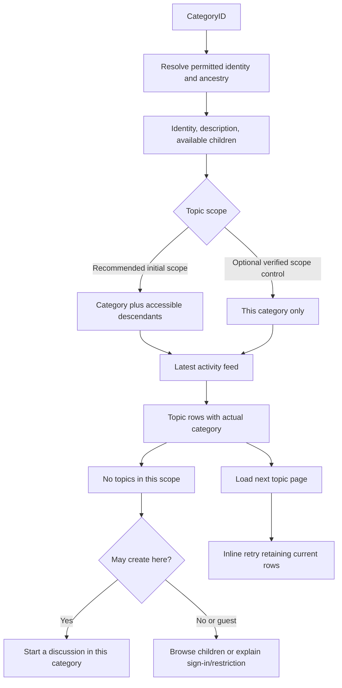
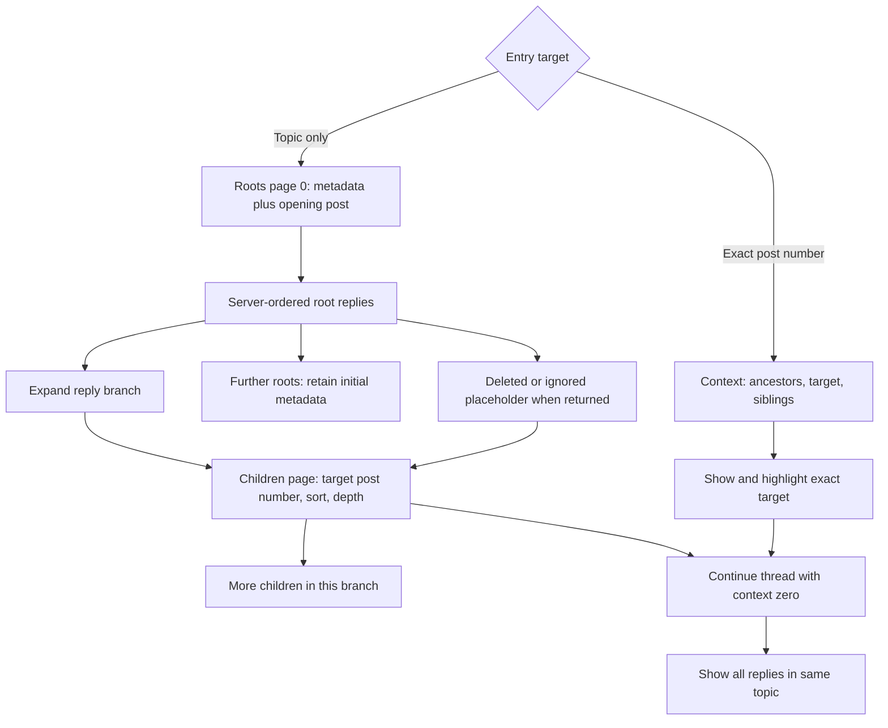
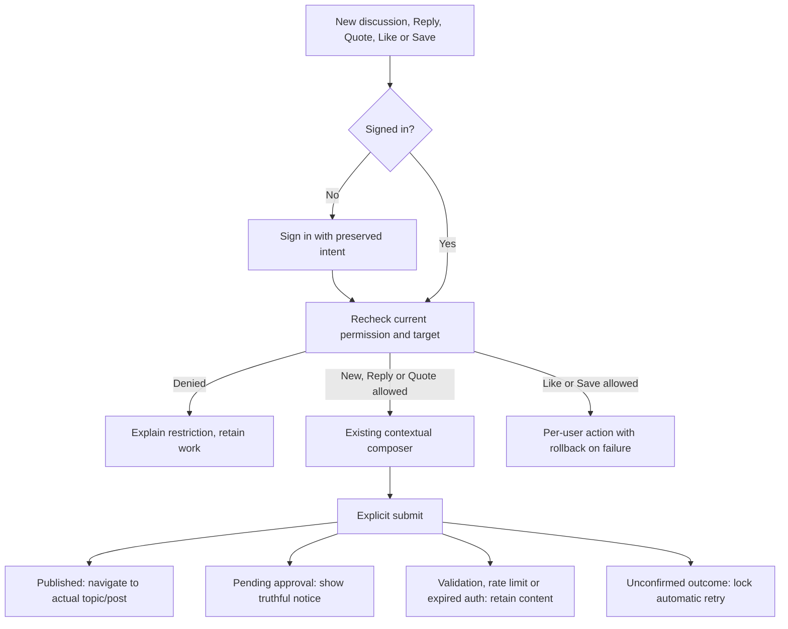

# Category, subcategory and topic IA

Recorded: 2026-10-06. Status: source-grounded planning artifact for the next screen work, before mockups. No app or backend behavior was changed. “IA” means information architecture. This maps entities and journeys, not the site's actual category names.

**User-confirmed hierarchy:** categories have one level of subcategories (root → immediate child, two levels total). This supersedes the earlier deeper-category design recommendation. The maps below use that product scope. Nested reply depth is independent and remains unchanged. Local Discourse source supports configurable deeper categories; the user's hierarchy constraint is not a claim that the backend universally forbids them.

Read alongside [current architecture](architecture.md), [broader historical IA](information-architecture.md), [launch handoff](design/mvp-design-handoff.md), and [API verification status](discourse-api-reference.md#category-and-topic-ia-source-review--2026-10-06). This focused map refines category/topic planning; it does not expand launch scope into category administration, tracking, chat, editing or moderation tools.

## Authority and evidence

The requested `discourse-archeologist` skill was read from `/Volumes/Develop/Projects/Fomio/.cursor/skills/discourse-archeologist/SKILL.md`. Its Expo and relative `discourse/` references are historical context; this project is SwiftUI and the actual reference is `/Volumes/Develop/Projects/Dicourse`. Backend HEAD was rechecked at `d4296c5ecf2bef4f11e42d8f3fd2282c8752f4e2`. The unrelated untracked `docs/sidebar-outlet-discovery.md` was not used.

**Verified source** below means routes, implementation, serializers, authorization and request examples were inspected. Specs were not executed, and there was no fresh deployed request. Prior live observations remain dated evidence in the API reference. Current deployment settings, taxonomy, member permissions and version alignment remain unverified in this pass.

**Proposed native behavior** describes the recommended screen and navigation contract, not an existing server feature or accepted visual design. Labels here use the project's working terms Community/Discussion; category/topic names remain useful engineering terms. Final site terminology requires the existing localization contract.

| Evidence | Backend path and identifier |
| --- | --- |
| E1: identity and associations | `db/structure.sql`: `categories.id/parent_category_id/topic_id`, `topics.id/category_id/closed/archived`, `posts.id/topic_id/post_number/reply_to_post_number`; `Category#parent_category/#subcategories`, `Topic#category/#posts`, `Post#topic` |
| E2: directory and detail | `config/routes.rb`: categories routes and `/c/:id/show`; `CategoriesController#index/#fetch_category_list/#show`; `CategoryList#find_categories/#paginate_results?`; `CategoryListSerializer`, `CategoryDetailedSerializer`, `BasicCategorySerializer` |
| E3: permissions | `Category.secured/.preload_user_fields!/.topic_create_allowed`; `CategoryGroup.permission_types`; `CategoryGuardian#can_see_category?`; `TopicGuardian#can_create_topic_on_category?/#can_create_post_on_topic?`; `TopicViewDetailsSerializer#include_can_create_post?` |
| E4: category feeds | `config/routes.rb`: `/c/*category_slug_path_with_id/l/:filter` and `/none/l/:filter`; `ListController` generated category actions, `#set_category/#category_default_view`; `TopicQuery#default_results/#list_latest`; `Category.subcategory_ids`; `TopicListSerializer`, `TopicListItemSerializer` |
| E5: nested topics | `NestedTopicsController#show/#children/#context/#ensure_nested_replies_enabled/#find_topic_with_topic_view/#ensure_not_pm`; `NestedTopic::ListRoots`, `ListChildren`, `ShowContext`; `NestedReplies::TreeLoader/Sort/PostTreeSerializer`; `TopicViewSerializer`, `PostSerializer` |
| E6: request evidence | `spec/requests/categories_controller_spec.rb`: hidden children, recursive featured topics and lazy pagination; `list_controller_spec.rb`: descendant feeds and canonical slug redirects; `nested_topics_controller_spec.rb`: roots/children/context, sort, deleted placeholders, visibility and visit tracking |

All backend evidence paths are relative to the checked revision under `/Volumes/Develop/Projects/Dicourse`. Each graph describes the relationship supported by its evidence or explicitly labels a native proposal.

## Map 1 — content hierarchy (user category scope; source entities: E1–E5)

```mermaid
flowchart TD
  Site[Discourse site] --> Root[Category: no parent]
  Root --> Child[Category: parent_category_id]
  Root --> T1[Topic assigned directly to root]
  Child --> T2[Topic assigned directly to child]
  T2 --> OP[Opening post: post_number 1]
  T2 --> R[Root reply]
  R --> C[Child reply: reply_to_post_number]
  C --> D[Further reply descendants]
  Root -. category.topic_id .-> About[Category description topic]
```

- A subcategory is the same Category entity with a parent. The Fomio design reuses the category template for a root and its immediate child; the child has no child-navigation section. Source `Category.subcategory_ids` supports deeper traversal up to `max_category_nesting`, but deeper taxonomy is outside the user-confirmed product scope (E1, E4). Do not silently discard unexpected deployed records; investigate any mismatch during integration.
- A regular topic has a category assignment. Seeing it in an ancestor's aggregated feed does not move it into that ancestor. Show the topic's actual category/path (E1, E4).
- A category description topic is distinct from an arbitrary “latest topic.” Featured directory topics are optional server-selected previews, not proof of chronological latest activity (E1, E2: `CategoryList#find_relevant_topics`).
- Category ID, topic ID, post ID and topic-local post number are different identities. Links/context/reply targets use post number; likes and post bookmarks use post ID. See the existing API reference for write contracts.
- Tags are orthogonal topic metadata, not another category level. Tag navigation/filters remain outside this screen slice until scoped and verified (E4: `TopicListSerializer`).

## Map 2 — screen and navigation map (native proposal)



Back is navigation history; the parent breadcrumb is category ancestry. They are separate actions. A discussion opened from Search returns to its query/results, while its category link opens its actual category. Preserve each tab's stack; preserve category scope, directory query/expansion, list position and topic branch/reading position. These retention rules refine the existing native architecture.

The directory's Find communities filters categories; it does not search posts. If the catalog is partial, label the result scope or fetch more before claiming “no matching communities.” Do not fabricate inaccessible category rows as a discovery feature (E2, E3).

## Screen inventory and content order (native proposal)

This is semantic order for design, not a layout or mockup. Optional information disappears when absent.

| ID | Screen | Required information in reading order | Context and actions |
| --- | --- | --- | --- |
| CA01 | Communities directory | Page identity; Find communities; permitted roots; descriptions; visible children; expansion/loading status | Open any loaded category; expand descendants; retry directory loading. Preserve source order rather than inventing popularity. |
| CA02 | Category with children | Full available ancestor path; category identity/description; child navigation; explicit topic scope; topic list | Open child/ancestor/topic; contextual New discussion; About. Missing identity uses a fallback, not stock category imagery. |
| CA03 | Leaf subcategory | Available ancestry; identity/description; its topic list | Same screen contract as CA02; omit an empty child-navigation section. |
| CA04 | About category | Category description and verified category description-topic link | Return to category; open the source topic when needed. No invented rules, membership counts or group access descriptions. |
| TO01 | Discussion | Title; actual category path; topic status; opening post/author; reply section; page/branch continuation | Topic Reply, post Reply/Quote, permitted Like, post Save, Share, profile links; preserve exact target and permissions. |
| TO02 | Exact reply / focused thread | Topic identity; available ancestors or truncation explanation; target highlight; target's children | Continue branch; Show all replies; return to original entry. Same topic identity, not a separate comments entity. |

Use server-supplied category descriptions and optional logos. A `read_restricted` cue, if mapped and verified for the viewer, means restricted access; it does not mean that an already visible category is inaccessible. Omitted or denied categories are not a curated list of locked communities (E2, E3).

## Map 3 — category list scope and loading (E2, E4; native proposal controls)



Recommended initial scope: category plus accessible descendants, with “Includes subcategories” when children exist. This matches the current adapter's request behavior. A “This category only” switch is an optional product proposal backed by `no_subcategories=true` or the `/none/l/latest` route; it needs deployed verification and adapter work before inclusion. Changing scope resets pagination and keeps a distinct list position (E4).

Latest means recent activity, not necessarily newest topic creation. `TopicQuery#list_latest` uses the topic-query ordering machinery, whose default activity order uses `bumped_at`; pins and configured ordering can affect placement. Preserve the returned order and avoid a misleading “Newest discussions” label (E4).

Keep directory pagination separate from topic pagination. `CategoryList` can paginate and limit embedded children when lazy loading is allowed or the accessible catalog exceeds its threshold. `include_subcategories=true` alone is not proof that the complete catalog is loaded. Resolve missing children/ancestors rather than claiming a category has none. JSON `CategoryListSerializer` does not expose the model's Markdown pagination marker; a complete-catalog loading strategy must be verified (E2).

## Map 4 — topic, branches and exact reply (source: E5, E6)



Normal replies remain on the discussion screen. Bound visual indentation and use focused-thread navigation for deep branches; preserve the returned tree rather than rebuilding it from numeric order. The source may flatten descendants at the configured nesting cap. Do not infer a parent from a missing node, and do not count unloaded branches as fully read (E5, E6).

New is the existing native requested reply sort. Retain both requested `sort` and `effective_sort`; make the actual order truthful. Do not introduce Top/Hot voting or ranking controls in this slice. Root ordering can include pinned replies. A deleted ancestor with visible descendants remains a placeholder where the server returns one (E5, E6).

Nested topic requests require `nested_replies_enabled` and topic visibility. Private messages redirect to the regular topic route; they are not public nested discussions. A 404 can mean disabled nesting, an inaccessible topic or a missing target. It cannot establish which condition occurred. Offer a truthful unavailable state; a verified original web link may be a fallback, without silently replacing the accepted nested experience (E5).

## Map 5 — actions, permission and outcome (native proposal; E3 and existing write contracts)



Visibility, new-topic permission and reply permission are independent. `CategoryGroup.permission_types` is full=1, create_post=2, readonly=3; the directory's global `can_create_topic` is not permission for every category. Topic reply permission comes from `details.can_create_post`, not category visibility, tree existence, or a guest CTA (E3).

Closed/archived status is visible context, but `can_create_post` is the authority for the current viewer: `TopicGuardian#can_create_post_on_topic?` has privileged exceptions. Slow mode and other posting constraints can still reject a permitted attempt; preserve writing and show the server's actionable result. Signing in restores intent and never submits automatically (E3; existing flows/recovery guide).

Share is a navigation/export action, not an authenticated write. Use the resolved topic/post destination and configured base URL; do not invent a deployment URL. Editing, flagging, topic notification controls and staff actions stay deferred unless explicitly added to scope, even when serializer permission fields exist.

## State coverage required before mockups

| Surface | States that must be represented |
| --- | --- |
| Directory | Initial loading; populated hierarchy; no permitted categories; no filter matches; partial catalog/children; initial failure; refresh failure retaining data; guest/login-required |
| Category/subcategory | Loaded identity with topics; leaf; children without direct topics; empty aggregate versus empty direct scope; read-only; guest; permission changed; missing ancestry; initial/next-page failure; stale content |
| Topic | Loading; opening post with no replies; closed; archived; current-user permission denied; root-page failure; child-only failure; inaccessible/missing; unsupported nested capability; supported-content fallback |
| Exact reply | Target found; earlier ancestry truncated; deleted/ignored placeholder; target missing; topic inaccessible; back to search/notification/Saved/shared-link context |
| Actions | Authentication canceled/expired; refreshed permission; validation/rate limit; pending moderation; unconfirmed publication; retained writing; Like/Save failure without losing reading position |

Offline means a failed connection or retained content where available; the map does not promise a durable offline catalog or sending queue. Partial-load failure must not erase already loaded rows or the rest of the topic tree.

## Feature packets — source trace

### Category hierarchy

**Goal:** Browse the viewer's permitted category tree without treating embedded children as necessarily complete.

**Entry Point:** `GET /categories.json?include_subcategories=true`, `GET /categories/:parent_category_id.json`, `GET /c/:id/show.json` → `app/controllers/categories_controller.rb` (`index`, `show`).

**Client Trigger:** `frontend/discourse/app/routes/discovery/categories.js` (`DiscoveryCategoriesRoute#findCategories`); `discovery/subcategories.js` reuses that route. Native `DiscourseService.communities()` is API-only.

**Server Path:** `fetch_category_list` → `CategoryList#find_categories/#paginate_results?` → `Category.secured`, ordering, optional recursive `subcategory_list`, viewer fields.

**Data Map:** Read `categories.id/parent_category_id/topic_id`; `Category#parent_category/#subcategories`; permission associations through `category_groups`; per-viewer `category_users`. No category creation is in this IA.

**Permissions:** `Category.secured` filters visibility; detail `show` calls `guardian.ensure_can_see!`; global creation plus category permission fields are preflight hints, with server revalidation. Category administration is staff-controlled and excluded.

**Async Side Effects:** No explicit job enqueue was found in the traced index/detail read actions. Do not imply that loading creates or joins a community.

**Realtime Side Effects:** Category model publishes `/categories` on category changes (`Category#publish_category/#publish_category_deletion`); directory reads do not subscribe for the native client. Realtime native freshness is not established.

**Serializer/JSON Contract:** `CategoryListSerializer`: `category_list.categories`, `can_create_topic`; `CategoryDetailedSerializer`: optional `subcategory_list`, `subcategory_ids`, counts and featured `topics`; `BasicCategorySerializer`: identity, optional parent, description, permission, restriction, settings, optional uploads.

**Tests:** `categories_controller_spec.rb`: “does not returns subcategories without permission”, “returns the right subcategory response with permission”, recursive topic assertions around `subsubcategory_response`, “paginates results when lazy_load_categories is enabled”. Read, not run.

**Safest Extension Plan:** Theme component first for web-only presentation; it cannot supply SwiftUI navigation. No extension is needed for the verified core data. If complete-catalog loading proves insufficient, evaluate existing search/list contracts before an authorized plugin endpoint. No core patch is justified.

**Verification Steps:**

1. `cd /Volumes/Develop/Projects/Dicourse && rg -n 'def fetch_category_list|def show|def find_categories|def paginate_results' app/controllers/categories_controller.rb app/models/category_list.rb`
2. `cd /Volumes/Develop/Projects/Dicourse && rg -n 'subcategory_list|parent_category_id|permission' app/serializers/{category_detailed,basic_category}_serializer.rb`
3. `cd /Volumes/Develop/Projects/Dicourse && bin/rspec spec/requests/categories_controller_spec.rb -e 'subcategor' -e 'paginates results'` (runtime verification still pending).

### Category topic list

**Goal:** Show topics with truthful category scope and pagination.

**Entry Point:** `GET /c/<slug-path>/<id>/l/latest.json`; direct-only `GET /c/<slug-path>/<id>/none/l/latest.json` → `app/controllers/list_controller.rb`, generated category actions. Native currently requests the ID form.

**Client Trigger:** `frontend/discourse/app/routes/build-category-route.js`, `AbstractCategoryRoute#_retrieveTopicList/#_createSubcategoryList`; native `DiscourseService.feed(category:page:)`.

**Server Path:** `ListController#set_category` → category action → `TopicQuery#list_latest/#default_results` → recursive `Category.subcategory_ids` unless direct-only.

**Data Map:** Read `topics.category_id/bumped_at/pinned_at`, `categories.parent_category_id`; per-user topic/permission state affects the returned list. No topics are reassigned by aggregation.

**Permissions:** Category visibility checked by `set_category`; secured topic query and user filters determine actual rows. Global `can_create_topic` is not a category-specific guarantee.

**Async Side Effects:** No explicit write/job enqueue in the traced category-list action. Preserve backend order; don't compute native popularity.

**Realtime Side Effects:** Web routes use topic-tracking services; a native subscription is not established by list JSON. Refresh/pagination are the baseline.

**Serializer/JSON Contract:** `TopicListSerializer` → `topic_list.topics`, optional `more_topics_url`, `per_page`, optional category/tag data; referenced users are serialized for list items. Preserve returned pagination semantics and optional fields.

**Tests:** `list_controller_spec.rb`: “returns topics from subcategories when no_subcategories=false”; child canonical-path redirect cases and relative-root cases. Source predicate for direct-only was read; no live direct-only comparison was performed.

**Safest Extension Plan:** Theme component for web list presentation; core API already provides scope. Native scope is adapter/state work. Use a plugin only for a proven missing contract; no backend change is authorized here.

**Verification Steps:**

1. `cd /Volumes/Develop/Projects/Dicourse && rg -n 'category_none_|no_subcategories|def set_category' config/routes.rb app/controllers/list_controller.rb lib/topic_query.rb`
2. `cd /Volumes/Develop/Projects/Dicourse && rg -n 'def self.subcategory_ids|more_topics_url|def list_latest' app/models/category.rb app/serializers/topic_list_serializer.rb lib/topic_query.rb`
3. `cd /Volumes/Develop/Projects/Dicourse && bin/rspec spec/requests/list_controller_spec.rb -e 'returns topics from subcategories'` (runtime verification still pending).

### Topic and exact-reply reading

**Goal:** Read a topic, paginate branches and resolve an exact reply without losing ancestry or permission semantics.

**Entry Point:** `GET /n/:slug/:topic_id.json`, `GET /n/:slug/:topic_id/children/:post_number.json`, `GET /n/:slug/:topic_id/context/:post_number.json` → `app/controllers/nested_topics_controller.rb` (`show`, `children`, `context`).

**Client Trigger:** Native `DiscourseService.discussion/children/context` → `DiscussionState`; web canonical topic routing is separate (`frontend/discourse/app/routes/topic.js`, `topic/from-params.js`). JSON must be requested explicitly because browser nested routes redirect.

**Server Path:** Setting gate → `TopicView` + Guardian visibility → `NestedTopic::ListRoots/ListChildren/ShowContext` → `NestedReplies::TreeLoader/PostPreloader/PostTreeSerializer`.

**Data Map:** Read `topics`, `posts.topic_id/post_number/reply_to_post_number/deleted_at`, nested metadata and per-user state; opening post is distinct from root replies. Topic-local post number is not a globally unique post ID.

**Permissions:** `ensure_nested_replies_enabled`, topic visibility and tree filters; PM redirect; `details.can_create_post` and post action summaries govern writes. Deleted/ignored placeholders can omit identity/content fields and inherit topic context.

**Async Side Effects:** `NestedTopicsController#track_visit` defers topic view counting; with `track_visit` and a member, it also defers visit tracking and may mark a nested topic caught up. JSON reads without `track_visit` avoid that member catch-up branch. Do not add this parameter as a substitute for viewport reading.

**Realtime Side Effects:** Initial metadata includes `message_bus_last_id`; this is a cursor, not a native subscription or guaranteed live updates. A native refresh/subscription policy remains separate work.

**Serializer/JSON Contract:** Roots: `roots/has_more_roots/page`; page 0 adds `topic/op_post/sort/effective_sort/message_bus_last_id`. Children: `children/has_more/page`. Context: `ancestor_chain/ancestors_truncated/siblings/target_post` plus topic/OP/sort metadata. `PostTreeSerializer` layers child/count/placeholder fields onto `PostSerializer`.

**Tests:** `nested_topics_controller_spec.rb`: “returns topic metadata and OP on initial load (page 0)”, “does not include topic metadata on subsequent pages”, “paginates children”, “flattens descendants at max depth when cap is enabled”, “returns ancestor chain, target post, and siblings”, “returns empty ancestors when context=0”, “preserves tree structure through deleted ancestors”, unauthorized/disabled 404 cases. Read, not run.

**Safest Extension Plan:** Theme component can change the web view only. Native tree presentation uses existing contracts; no plugin/core change is currently required. Missing deployed capability is an integration gate, not permission to enable or patch it.

**Verification Steps:**

1. `cd /Volumes/Develop/Projects/Dicourse && rg -n 'nested_topics|children/:post_number|context/:post_number' config/routes.rb`
2. `cd /Volumes/Develop/Projects/Dicourse && rg -n 'ensure_nested_replies_enabled|should_track_visit|effective_sort|ancestor_chain' app/controllers/nested_topics_controller.rb app/services/nested_topic lib/nested_replies`
3. `cd /Volumes/Develop/Projects/Dicourse && bin/rspec spec/requests/nested_topics_controller_spec.rb -e 'GET show' -e 'GET children' -e 'GET context'` (runtime verification still pending).

## Native gaps and next build order

The inspected native implementation already has shared category feeds and nested topic/context navigation. This map is a refinement of working screens, not an empty-project scaffold.

| Gap observed in native source | Needed before the corresponding mockup promise ships |
| --- | --- |
| `FeedView.swift` directory grouping and `ComposerView.swift` destination groups enumerate roots and immediate children | This depth matches the user-confirmed hierarchy. Verify catalog completeness, root/child destination selection and full long names; deeper-category UI is not required in this scope. |
| `DiscourseService.communities()` performs one categories request | Establish catalog/child completeness under lazy loading and missing ancestry; local filtering cannot guarantee exhaustive results. |
| Identity/description/About fields were absent in the initial adapter | Implemented 2026-10-06: optional category identity, excerpt and introduction URL are decoded; known marker mappings and HTTPS logos are rendered. Secure/custom assets remain unresolved. |
| Category feed has no scope parameter in `CommunityService` | Keep initial aggregate scope explicit; add direct-only only if included and verified. |
| Effective sort and archived status were absent in the initial adapter | Implemented 2026-10-06: initial/context metadata retain effective sort and archived, with permission-based Reply. Slow-mode guidance remains unresolved. |
| Current exact-reply view keeps only a bounded ancestor suffix | Retain a clear truncated-context path and return to the whole topic without losing entry context. |

Recommended sequence:

1. Resolve catalog completeness and root/child ancestry; lock category-scope semantics and screen/state IDs above.
2. Produce category and subcategory mockups using this semantic map, including empty/read-only/partial states.
3. Produce topic mockups covering normal, exact-reply, focused-thread, deleted-placeholder and branch-failure states.
4. Implement the selected native refinements with fixture/contract coverage, then verify deployed read and per-user write behavior separately.

User-confirmed: one subcategory level. Unresolved: deployed alignment and actual taxonomy; lazy-category configuration; current member category/create/reply rules; current nested settings and effective sorting; category About/media fields on the deployment; secure-content handling; read-tracking/realtime policy. The diagrams do not choose category names, alter the server hierarchy or authorize backend writes.
