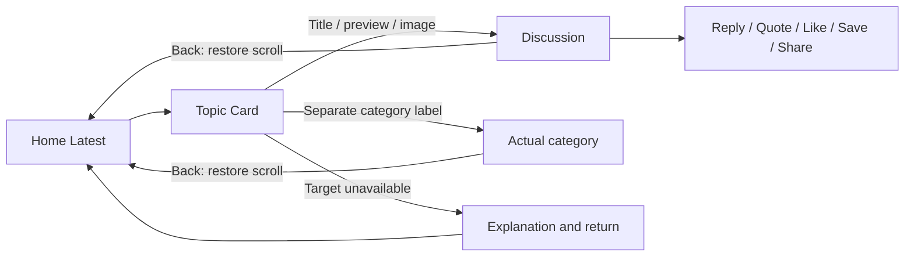

# Topic Card Home prototype

Requested: 2026-10-07. Status: Claude Design prototype created; representative independent browser review completed. Native implementation/acceptance pending.

Destination: existing [Fomio design project](https://claude.ai/design/p/10e05e50-973c-4ddb-836f-406e5456a4f2). Build iOS Apps' SwiftUI UI Patterns guidance informs the native handoff; this pass requests a browser design prototype, not production SwiftUI changes.

## Design brief

Create a separate `Topic Card - Home Native 2026-10-07` artifact. Preserve historical category/topic/composer artifacts and shared components. Compare compact editorial and softly contained compositions in mixed Home feeds, recommend one, and provide working topic/community navigation with retained Home scroll position.

Hierarchy: actual category marker/name, strongest topic title, optional excerpt/thumbnail, original author, reply count and explicitly labeled recent activity. Conditional Pinned/Closed/Archived examples must distinguish proposals from current adapter support. Topic title/preview/image open the same discussion; category is a separate accessible target. Reply count is informational. Like/Save/Share stay in Discussion. Unavailable targets offer recovery.

Use the latest compact Elevated Fomio direction: iOS/iPadOS 26+, system sans, 17pt topic titles, 15pt excerpts, 13pt metadata with accessible reflow. Backend category identity remains independent of global Discourse theme accents. Two category levels only. Four tabs: Home, Communities, Notifications, Me; utility Search and contextual Create. Latest preserves returned activity order including pins.

Fictional fixture cases: text-only, excerpt, thumbnail, failed media, pinned, closed/archived, zero replies, long title/category, Arabic/English, absent author/avatar/excerpt. Feed loading/empty/refresh/pagination failure and unavailable-after-tap. Reviewer controls outside product chrome: two compositions, Purple/Teal/No scheme, light/dark, default/AX2 approximation, narrow phone and iPad. Keep at least 44pt targets, separate buttons, flexible heights, stacked metadata, reduced motion and readable titles.

Native handoff: one value input model, stable topic ID, composed category/preview/author-activity/status views, explicit navigation callbacks, local reviewer state and asynchronous image/loading states.

## Navigation and state map

| Component input | Baseline behavior | Optional extension |
| --- | --- | --- |
| Topic identity/title | Stable ID and readable primary title | Unicode title after adapter verification |
| Category | Exact category, configured identity and accessible destination | Parent context for ambiguous child names |
| Excerpt | Omit absent content and close spacing | Longer accessible preview |
| Media | Text layout when absent/failed | Verified remote thumbnail with loading state |
| Author | Original author; omit absent identity | Verified avatar/profile destination |
| Activity | Reply count and active age | Member read state after verification |
| Status | Viewer-resolved pin | Closed/archived summaries after adapter work |

Feed states belong to the feed container, not to every card. Pagination failure retains existing cards and offers retry. Refresh failure retains readable existing content. Optional-field failure must not block topic navigation.

## Evidence boundaries

Local backend revision rechecked at `d4296c5ecf2bef4f11e42d8f3fd2282c8752f4e2`. Current `DiscussionSummary`/live adapter retain title/category/excerpt/author/replies/activity/pinned. Images are fixture-only in the current adapter. Backend serializers expose optional media and engagement fields; this review does not establish their deployed availability, controller/authorization contracts or member permissions. Original author differs from last poster; activity differs from creation age; topic likes differ from opening-post likes. No feed heart count is requested.

Required browser checks: default/light, Teal/dark, AX2, 320pt phone and iPad; scrolled Home → Discussion → Back; category → Back; unavailable → Back; pagination failure → retry; theme/composition switching. Browser evidence does not establish native Dynamic Type, VoiceOver, Liquid Glass, live APIs or permission behavior. See [API reference](../discourse-api-reference.md) for verified integration status.

## Delivered prototype and review

[Topic Card - Home Native 2026-10-07](https://claude.ai/design/p/10e05e50-973c-4ddb-836f-406e5456a4f2?file=mockups%2FTopic+Card+-+Home+Native+2026-10-07.dc.html) contains Compare, Card cases (TC-01–TC-11), Feed states (ST-01–ST-05), Prototype and Handoff views. Claude reports five new files: the main board, `mockups/FmHomeFeedDevice.dc.html`, `mockups/FmTopicCardHome.dc.html`, and fictional wood/garden thumbnail PNGs. Existing shared category/topic/composer files were preserved according to Claude's report; no native app/backend files were edited in this task.

Recommended direction: 1a Compact editorial for Home, with 1b Softly contained as an optional visual variant. This is a design recommendation, not user acceptance. Both use the same information hierarchy and distinct sibling topic/category targets.

Independent checks through the rendered browser UI:

- Scrolled Home to 804px, opened ESP32 discussion, returned through Back: visible Home offset readout remained 804px.
- Opened its separate Microcontrollers label: actual child category with Electronics parent. Back restored the same 804px offset.
- Bench power supply opened unavailable explanation; Back to Home restored the feed.
- Scrolling to the bottom triggered a pagination failure. Try again displayed loading, then page 2 loaded with three extra cards and No more topics.
- Refresh failed retained cards; Try again displayed Refreshing, then removed the warning.
- Inspected default Purple/light editorial, Teal/dark AX2 with vertically stacked metadata, 320pt editorial and contained iPad. Theme, text-size, device and composition controls changed the rendered views.

Captures: [editorial Home](snapshots/2026-10-07-topic-card/editorial-home.png), [Teal dark AX2](snapshots/2026-10-07-topic-card/teal-dark-ax2.png), [contained iPad](snapshots/2026-10-07-topic-card/contained-ipad.png), [narrow editorial](snapshots/2026-10-07-topic-card/narrow-editorial.png). Canvas zoom is 75% for editorial/narrow and 50% for dark/iPad; it is separate from mock accessibility scaling.

Limits: representative browser review only. The 320pt tab labels abbreviate in the mock shell; native tab adaptation and bottom safe-area/content behavior need validation. All topic/user/category fixtures and thumbnails are illustrative. No deployed media/status contract, real native accessibility, material rendering, contrast audit or physical-device result is established. Claude reported a background review still running; its completion is not counted as evidence.

## Home appearance menu — 2026-10-08

User requested seeing the proposed switch implemented. Claude updated the existing browser prototype with a Home options ellipsis beside Search/Create, opening a Feed appearance menu: Compact (1a) and Cards (1b), with selected checkmark. Selection closes the menu, updates the feed and stores a browser-local preference; the native handoff proposes SwiftUI Menu/Picker and AppStorage. This is prototype implementation only.

Claude reports changes to `mockups/FmHomeFeedDevice.dc.html` and the main Topic Card board, preserving card and historical shared files. It reports topic-anchor restoration when switching, synchronized reviewer controls/category feeds, keyboard/Escape/outside dismissal, and dark/narrow/AX2 checks. Its measured topic #5 position changed 64→63px while raw offset changed 900→1161px; topic Back retained Cards and the offset. These are Claude-reported checks, not independent native evidence. Loaded-page/error preservation and unavailable-storage fallback were not exercised.

Independent browser checks: selected Cards in the product menu; feed changed to contained cards and readout reported Cards with anchor #1 at 162px. Reloaded the preview, reopened Prototype: Cards persisted. Reopened Home options and visually confirmed Cards checkmark. Left that menu open for review. Capture: [Feed appearance menu](snapshots/2026-10-08-topic-card/feed-appearance-menu.png), at 75% canvas zoom. Native app/backend code was not changed.
