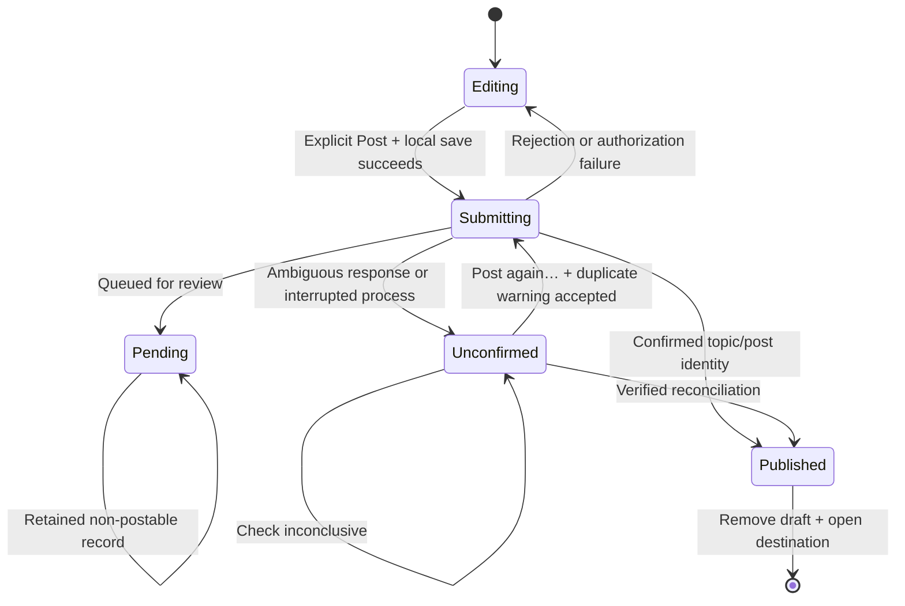

# User flows and recovery contract

This records current native behavior and its limits as of 2026-10-03. Discourse remains authoritative for live visibility, permissions, validation and moderation.

## Screens and actions

| Entry | Current behavior |
| --- | --- |
| Home | Latest feed, available category context/title/excerpt/author/activity/reply count and optional photo; no feed Like count |
| Communities | Flat directory with parent/child context, two children initially visible, expansion and local “Find communities” filtering |
| Community | Shared parent/child feed screen; Create inherits the permitted category |
| Discussion | Opening post, nested replies, contextual Reply/Quote/Like/Save/Share; independent roots and child pagination |
| Search | Discussion search inside originating tab; query/results/pagination/anchor retained in that tab’s memory |
| Notifications | Replies/mentions; resolve topic plus optional exact post number before marking read |
| Me/profile | Basic own/other-member profile and recent discussions; Saved, Drafts and sign-out |
| Composer | New discussion, reply, quote or resume using raw text, plain links and one photo |

Unavailable fields are omitted or use an honest fallback. Community artwork uses a letter when no verified logo exists. Live Share uses the configured site destination; fixtures cannot claim a real shared post URL.

## Authentication return intent

Guest Reply/Quote retains the intended post while presenting sign-in. Successful authentication reloads categories and rechecks the target’s reply permission/context before opening the composer. New discussion creation checks available permitted destinations. Neither flow posts automatically.

Guest Like/Save returns to a refreshed discussion and asks the member to tap the action again. Authentication does not execute those mutations. Cancel clears pending intent. A different newly authenticated account closes the previous account’s composer and keeps that draft scoped to its owner. Guest drafts, if any, migrate to the newly authenticated account.

Explicit sign-out warns that current-account local drafts will be deleted. Draft cleanup and Keychain removal must succeed before the app reports sign-out complete. Operations are sequential, not transactional: partial deletion is possible if a later step fails, and the error is surfaced.

## Nested navigation

Opening a discussion loads its opening post and root page. Child branches begin collapsed behind labeled controls; expanding one fetches children separately. Pagination errors belong to the affected root/branch and do not erase loaded siblings. Loaded data and expansion live in the tab’s discussion cache.

At the visible indentation bound, “Continue this thread” opens focused context. An exact target route requests ancestor context, expands the visible chain, highlights and scrolls to the target. At most two ancestors plus target are visible; truncated context is announced. Deleted placeholders retain identity. Missing/private/denied context must remain an explicit error, without invented ancestry.

Fixtures expose an explicit unsupported-nesting state. Live 404 can mean disabled nesting, inaccessible topic or missing target, so it cannot by itself certify unsupported capability. The app never substitutes chronological replies; live acceptance requires enabled nested APIs.

## Composer readiness

Post requires member identity matching the draft’s account, editing state, nonempty raw body and resolved photo state. New discussions additionally require a nonempty title and an available category with create permission. Server validation can still reject a locally ready form because trust, tags or site-specific fields are authoritative.

Draft persistence, upload, authorization and submission are independent states. A photo upload does not publish a post. An expired authorization does not erase writing. A successful local save does not prove publication.

The live reconciliation adapter currently always returns unresolved. Pending records have no implemented automatic approval reconciliation. Unconfirmed offers Check again and Back first; Post in the header stays disabled. “Post again…” shows a duplicate warning, and only its explicit “Post again” button sends again. Nothing is retried automatically. Pending review closes the composer and shows a dismissable “Submitted for review” notice on the screen the post was written from; the locked local record stays in Drafts so it cannot be posted twice. Concurrent/repeated Post taps are blocked by the submitting state. There is no offline send queue or automatic posting retry.

## Local draft lifecycle

Text/title/category changes debounce autosave by 500 milliseconds. Backgrounding also attempts save. Atomic version-1 JSON records include UUID, account, intent, title/body/category, uploaded reference or missing-photo marker, submission state and timestamp. Only that account’s records are listed.

Before sending, the app saves a submitting record as **unconfirmed on disk**. Termination after the server may have accepted the request therefore restores a locked record rather than an editable duplicate. In-memory state stays submitting during the request.

Close with unchanged writing simply closes. Close after any change to title, text, community or photo presents Keep draft, Discard and Keep editing (“You changed this draft.” for a resumed draft). That choice is the confirmation, so Discard removes the local record directly; it does not delete a submitted server post. Keep closes only after local save succeeds. Drafts are not server-synchronized. Successful publication deletes the local record and restores origin; if cleanup fails, the app retains a locked record and reports that publication succeeded but cleanup failed. This cleanup fallback uses the current pending flag and is not evidence of moderation.

## Photo lifecycle

Picked photos are converted to JPEG for multipart upload. One attachment is supported. Progress, cancellation, failure, retry and removal are exposed. While uploading or failed, Post is disabled. Photo bytes remain in memory and are not stored in the local draft.

Keeping an unfinished attachment warns that it will not be retained. Resume shows “Photo not kept” with Add photo again or Continue without photo. Either choice resolves the missing-photo block. Successfully uploaded live photo references persist; whether they remain usable is a deployment contract to verify. Fixture upload references are deliberately discarded on save because they are fictional, so fixture recovery also requests a photo again.

## Honest failure states

Loading, empty and retry states exist across native lists. Discussion handles closed topics, deleted/ignored placeholders, denied/unavailable context and unsupported fixture capability. Errors preserve writing and loaded content where possible. No empty feed is used to hide a failed request, and no uncertain result is relabeled published.

See [release acceptance](release-readiness.md) for scenarios still requiring native-device and live evidence.

## Keyboard and focus — 2026-10-04

Composer opens with the keyboard down, including resumed drafts with missing-photo or submission recovery. Title and body have distinct native focus. Next moves from title to body; Return in the body inserts a newline. A native keyboard toolbar exposes Done. Dragging the composer, discussion search or community directory dismisses the keyboard interactively. Search submission and leaving search clear input focus without clearing the retained query.

Post clears input focus before sending. Command-Return invokes the same guarded Post action; Escape invokes Cancel with the existing Keep/Discard protection. Locked submission records cannot retain editing focus. Recovery changes reveal rejection, expired authorization, uncertainty, locked pending records, missing photos, failed uploads or generic errors with a scroll target and accessibility focus. Ordinary autosave and upload progress do not repeatedly move focus. Recovery scrolling respects Reduce Motion. Signing in again keeps the keyboard down and never posts automatically.

Cancel suspends editing focus. Keep editing restores the previous field if the same composer is still open and editable. Destination and photo presentations suspend focus and restore it after dismissal; native TextSelection bindings snapshot and restore the insertion range rather than replacing editor text. Keeping/discarding a draft and publication close the composer. Backgrounding still saves changed drafts; focus on foreground return remains managed by the system.

Native SwiftUI safe areas and keyboard toolbars manage docked keyboards; no fixed keyboard-height assumptions or global tap-to-dismiss gestures are used. Floating keyboards, physical keyboard navigation/shortcuts, VoiceOver announcements, real Photos picker dismissal, rotation, RTL and resized iPad windows still require device acceptance unless separately recorded in implementation status.

Design references: [Apple Virtual keyboards](https://developer.apple.com/design/human-interface-guidelines/virtual-keyboards), [Keyboards](https://developer.apple.com/design/human-interface-guidelines/keyboards), and [Focus and selection](https://developer.apple.com/design/human-interface-guidelines/focus-and-selection/). Apple search excerpts were read; the direct pages returned JavaScript shells in this session. This is source-informed implementation, not a claim of exhaustive HIG compliance.
