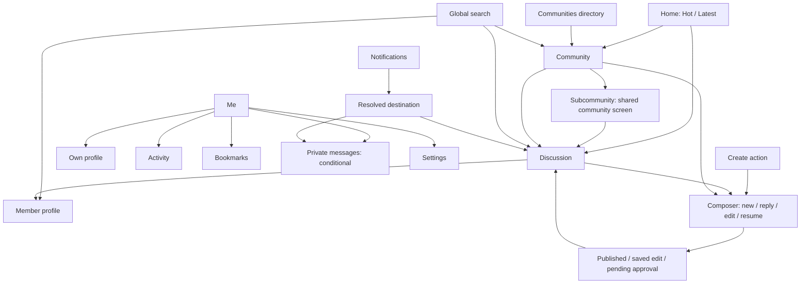
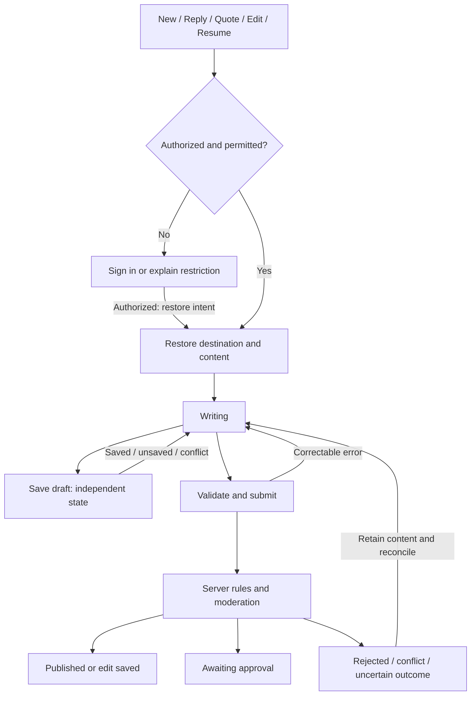

# Fomio information architecture

Recorded: 2026-10-02. Status: broader historical planning map, retained for traceability. The accepted launch scope is implemented in fixtures; [current architecture](architecture.md) and [implementation status](implementation-status.md) describe the app.

MVP scope update: 2026-10-03. Use the [finalized design handoff](design/mvp-design-handoff.md) for first-release scope and presentation. This map remains the broader roadmap. Launch uses one discussion feed, discussion search, a community directory, basic profiles/Saved/Drafts, and minimal creation/reply. Advanced tracking, activity/settings, private messages, chat, AI, multiple editor modes and plugin tools are deferred. Latest-only Home and required nested replies are accepted decisions; deployed availability and effective nested sorting still require verification. iOS 26+ Liquid Glass is the selected design target.

## Basis and decision authority

This map replaces the imported web/Expo route inventory as the iOS planning map. It follows the [project foundation](project-foundation.md), informed by the [imported references](ia-build-guide.md), especially Home (23), Search (24), Profile (25), and the composer corrections in 22. Imported documents remain historical evidence and retain their original wording.

The web checkout was rechecked at `5fb77cab4088767b5dfeee56d36ef74b21c36a4b`; imported manifest files match its current documentation, and the profile reference matches its source. Backend HEAD at that historical review was `efbd165d6182b1c31cd8afd224625aef300689bd`; the implementation review rechecked `d4296c5ecf2bef4f11e42d8f3fd2282c8752f4e2` on 2026-10-03. Most web runtime observations target `7b4f0970` and are not iOS deployment verification. See [API status](discourse-api-reference.md).

“Community,” “discussion,” “reply,” and “Me” are working iOS labels. Final localization and alignment with site-text overrides remain open. Discourse owns category hierarchy, content, permissions, notification levels, posting validation and moderation. No separate community membership, recommendation engine, or backend data model is introduced.

## Content map

A community maps to a Discourse category. A subcommunity is a category with a parent, not another entity type. A discussion maps to a topic; its opening post and replies are posts. Private messages use Discourse's message semantics and recipient permissions; chat is a separate, unresolved capability.

## Navigation shell

| Entry | Destination | Guest behavior | Member behavior |
| --- | --- | --- | --- |
| Home | Cross-community discussion feed | Read permitted content; Hot and Latest | Same, with optional tracked-community filtering where verified |
| Communities | Directory and community hierarchy | Browse permitted communities | Browse and manage supported notification levels |
| Notifications | Notification list | Explain sign-in requirement when selected | Open permitted targets; support read state once verified |
| Me | Account hub and own profile | Sign-in entry | Profile, Activity, Bookmarks, Drafts, conditional Messages, Settings |
| Search | Global search destination | Search accessible discussions, communities and members | Same with authorized content |
| Create | Composer presentation, not a navigation tab | Authenticate and retain creation intent | New discussion with permitted destination, inherited from current community when appropriate |

Home, Communities, Notifications and Me are the four primary destinations. Search is a global utility; Create is a separate action. Reply, quote, edit and resume are contextual composer entry points. Proposed native behavior: retain each destination's navigation and reading position when switching tabs; adapt layout to available iPhone/iPad space without changing content hierarchy. Exact placement and composer sheet/full-screen adaptation belong to UI design.

Do not add a separate Explore/Discover destination, mandatory interest-selection onboarding, duplicate feed routes, a dedicated comments screen, or a permanent chat entry under this baseline. Guest access follows site permissions; a login-required site must show its restriction rather than imply public access.

## Screen and action map

| ID | Screen | Content and local navigation | Actions and boundaries |
| --- | --- | --- | --- |
| H01 | Home | Hot/Latest; discovery cards; tracked filter is separate from sort | Open discussion, community, author. Cards show only available title/excerpt/image/author/age/reply/like fields. Save and Share live in Discussion. Card like is conditional on payload and permission verification. |
| CO01 | Communities | Directory with parent/child hierarchy; tracked shortcuts if supported | Open community; empty tracking offers browsing rather than forced onboarding. No invented follower/growth counts. |
| CO02 | Community/subcommunity | Identity, description, parent context, children where present, discussions | Latest-first is the proposed iOS default, reflecting the web direction; Hot and About only where supported. Create preselects this category if permitted. Notification-level control distinguishes Tracking, Watching and other supported levels. |
| D01 | Discussion | Title, community path, opening post, replies, status, read position | Reply/quote, bookmark, share, like and overflow actions follow permissions. Distinguish topic-level from post-level controls. Closed, archived, deleted and inaccessible cases have explicit states. |
| SE01 | Search | Query, result types, result content, supported sorting/filters, pagination | Open discussion/reply, community or member. Do not promise tabs or filters unsupported by the selected API. Query and result position survive navigation back. |
| N01 | Notifications | Supported types, unread/read state, pagination | Resolve target before navigation; deleted or inaccessible target shows a recoverable explanation. Notification badge and push delivery are separate concerns. |
| ME01 | Me | Own profile plus Activity, Bookmarks, Drafts, Messages and Settings entries | Show conditional entries according to verified capabilities; sign out clears member secrets and account-bound state. Draft retention on sign-out needs a policy decision. |
| U01 | Member profile | Identity, available bio/metadata, overview and supported activity | Own and other-member variants. No invented follower counts; Message appears only if permitted and in scope. Latest web profile updates favor readable named navigation and expandable bio. |
| A01 | Activity | Supported topic/reply activity and pagination | Open exact discussion/reply; filters reflect actual API capabilities. |
| B01 | Bookmarks | Saved items and supported metadata | Open target; manage bookmark only after type/ID and update/delete contracts are verified. Missing targets remain understandable. |
| DR01 | Drafts | Recoverable composer work and truthful local/server save status | Resume/discard; handle sequences and conflict. Proposed entry under Me; storage and cross-device synchronization remain open. |
| PM01 | Private messages | Authorized inbox/conversation and recipients | Conditional supporting scope. Do not reuse public-community creation assumptions or conflate with chat. |
| ST01 | Settings | Account/preferences supported by Discourse; app-specific preferences if needed | Identify server-owned versus device-owned values. Unsupported advanced account/moderation tools may use a verified web destination. No fabricated URL. |

Discussion layout must be settled before implementation. The latest web direction uses Discourse's nested replies, superseding older flat-stream notes. For iOS, nesting depth, ordering, collapse, pagination and exact-reply navigation need contract review and a product decision; the existence of the web renderer does not prove a native-client contract.

Tracked behavior also needs resolution: older references report Hot/Top ignoring the tracked filter. Do not display an active filtering state when results are unfiltered. Verify supported combinations and then choose disabled controls, a clear switch to a supported feed, or another explicitly documented treatment.

## Composer map

One composer shares components across new discussion, reply, edit and draft resume. Intent determines required fields and permitted actions; private-message creation is conditional and requires its own recipient contract. Presentation changes must preserve content and ongoing work.

| Reference IDs | State family | Native-client requirement |
| --- | --- | --- |
| C01–C03 | New discussion and destination | Permitted community hierarchy; context inheritance; title/body requirements from server; restriction cues based on actual permission data |
| C04–C05 | Rich text / Markdown | Editor capability and conversion fidelity need a separate iOS decision; modes are not different post types |
| C06–C08 | Image, link, advanced insertion | Upload progress/cancel/failure and plain-link fallback; poll/forms/tools appear only after availability and content contracts are verified |
| C09 | Similar discussions | Optional new-discussion guidance; not a mandatory reply step |
| C10–C11 | Reply/quote and edit | Topic and reply-target context; original editable content/version; eligible first-post metadata; preserve quote attribution |
| C12, C14–C15 | Draft, offline and conflict | Separate saved/unsaved/conflict states; retain writing on failure; no silent overwrite or unsupported recovery guarantee |
| C13, C19 | Validation, restriction and auth | Explain actionable errors, retain intent and content, handle permission changes and expired authorization |
| C16–C17 | Submission result | Published, saved edit and pending moderation are distinct; ambiguous transport failure must not trigger blind duplicate submission |
| C18 | Guided form | Conditional feature; template assignment, fields, validation and output require verification |

The draft save status, per-upload status, editing mode, intent, presentation and submission status are independent axes. A local save must not be labeled server-saved. The web theme's accepted offline-close risk is historical; the native app needs its own persistence policy. Category visibility should be represented by trustworthy restriction cues, reflecting the latest removal of the web's inferred Public/Private row. Literal AI assistance is outside the current baseline.

## Authentication and link routing

Use per-user authorization and Keychain storage. Guest reading precedes authentication where allowed. Capture an intended action with its category/topic/post context, return after authorization, and recheck permission before executing it. Never submit automatically merely because login completed.

| Incoming content | Internal destination identity | Verification required |
| --- | --- | --- |
| Discussion link | Topic ID plus optional post number | Resolve slug changes and post-stream location; post number is not post ID |
| Community link | Category ID and resolved parent path | Determine parent/child from data; do not route every category as a subcommunity |
| Member link | Resolved username/member identity | Renames and inaccessible profiles |
| Search link | Supported query/filter values | Supported URL parameters and search contract |
| Notification | Notification ID/type and resolved target | Payload-specific destination; read-state behavior |
| Authorization callback | Pending authorization attempt | Callback registration, validation and cancellation |

These are logical destinations, not new public URL schemes. Universal-link domains, custom schemes and push transport remain unconfigured. Honor the eventual deployment's relative URL root.

## Shared states and journeys

Every data screen needs initial loading, populated content, empty, refresh/pagination failure, offline/stale where applicable, and inaccessible content treatments. Separate “no results,” “nothing tracked,” and “permission denied”; each needs a useful next action. Member writes additionally handle expired session, validation, rate limits, moderation, conflict and uncertain outcome. Keep destructive discard distinct from dismissing a sheet.

| Journey | Acceptance outcome |
| --- | --- |
| Guest → Home → discussion → Reply → authorize | Return to intended reply without losing context; no automatic post |
| Communities → subcommunity → Tracking → Home | Persist server notification level; filter actually narrows supported feed; empty state offers discovery |
| Community → Create → upload → publish | Correct permitted destination; upload failure retains work; published result opens correct topic |
| Notification/shared link → exact reply | Correct topic/post number; visible target or clear unavailable state |
| Writing → background/offline → resume | Truthful persistence status; recover according to verified storage policy; resolve conflict explicitly |
| Submission → timeout → recovery | Reconcile outcome before retry; no assumed idempotency |
| Search → member → Activity → discussion → back | Preserve query, selection and reading positions |
| iPad resize / large text / RTL / VoiceOver | Navigation and writing remain usable; content and pending uploads survive layout changes |

## Open decisions and build order

Open product decisions: initial Home sort; Tracked on Hot; flat/nested reply presentation; native editor modes; draft storage/synchronization/sign-out retention; launch depth for private messages and account settings; final localized labels; iPad shell/composer presentation. Chat, AI assistance and additional plugin controls require separate scope decisions.

Pending integration resources: deployed base URL and version mapping, enabled plugins/settings, member test access, user-key scopes and callback configuration, iOS minimum version/bundle/signing, push and universal-link configuration. The web/theme source checkout is now known; custom backend plugins and deployment alignment remain unresolved.

Build in this order: verify authentication and read contracts; prototype H01 → CO02 → D01 → composer with guest/member and failure states; prove post pagination, posting/moderation/upload/draft recovery; add SE01/N01/ME01 and supporting surfaces as their contracts are verified; complete device/accessibility checks. A screen's presence in this IA expresses product intent, not implementation readiness.
